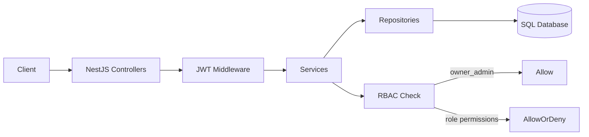
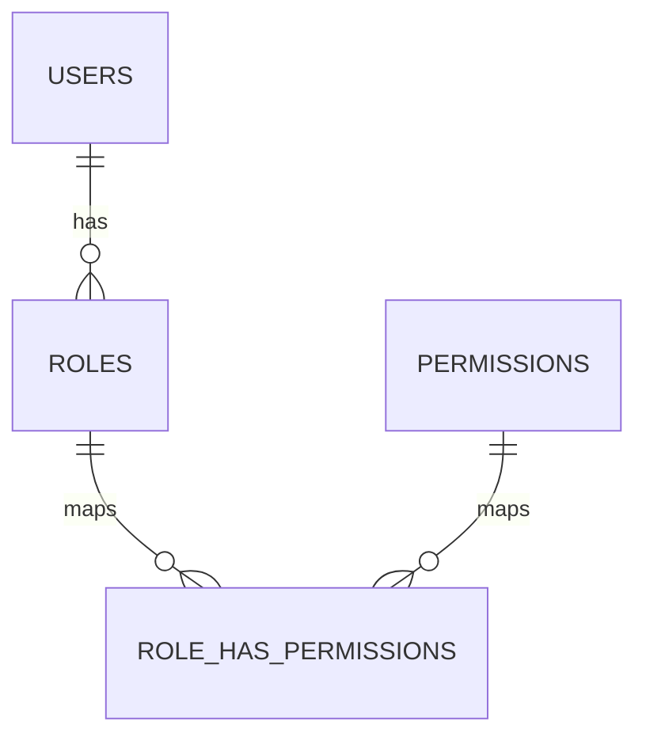

# Finance Dashboard Backend

A modular backend system built with NestJS and TypeORM that implements role-based access control (RBAC), financial record management, and analytics endpoints for a dashboard use case. The design emphasizes separation of concerns, database-driven authorization, and extensibility.

---

## Table of Contents

1. [Overview](#1-overview)  
2. [Architecture](#2-architecture)  
3. [RBAC Model](#3-rbac-model)  
4. [Data Model](#4-data-model)  
5. [Seed Data](#5-seed-data-roles-permissions-owner-admin)  
6. [Financial Records and Analytics](#6-financial-records-and-analytics)  
7. [Execution and Setup](#7-execution-and-setup)  
8. [Design Considerations](#8-design-considerations)  

---

## 1. Overview

The system provides:

* User and role management with database-driven permissions
* Secure authentication using JWT with refresh sessions
* Financial record CRUD with filtering
* Aggregated dashboard analytics (totals, trends, categories)

Authorization is enforced at the service layer using role-permission mappings stored in the database. A privileged role (`owner_admin`) bypasses permission checks to simplify administration.

---

## 2. Architecture



* Controllers are thin and delegate to services
* Services encapsulate business logic and authorization
* Repositories handle persistence via TypeORM
* RBAC checks are centralized and reusable

---

## 3. RBAC Model

Authorization is implemented using a Role + Permission model.



* Each user is assigned a single role
* Roles are associated with multiple permissions
* Permissions are expressed as `resource.action` (e.g., `user.create`, `record.view`)
* `owner_admin` bypasses all permission checks (no need to persist full mappings)

Authorization flow:

1. Request is authenticated and `req['user']` is populated
2. If role is `owner_admin`, request is allowed
3. Otherwise, role permissions are fetched from DB
4. Required permission is matched and access is granted or denied

---

## 4. Data Model

Core tables:

* `users` (user profile, role reference, status, soft delete)
* `roles` (role definitions)
* `permissions` (permission registry)
* `role_has_permissions` (role-permission mapping)
* `user_sessions` (refresh token storage)
* `financial_records` (transactional data for dashboard)

The schema is managed by TypeORM; tables are created automatically based on entities. No manual DDL is required.

---

## 5. Seed Data (Roles, Permissions, Owner Admin)

Roles and permissions are seeded manually to establish the initial RBAC baseline. The design supports adding new roles and permissions without code changes.

### Roles

| role_id | name        | type        | status  |
| ---: | ----------- | ----------- | ------- |
|    1 | Owner Admin | owner_admin | Disable |
|    2 | Admin       | admin       | Enable  |
|    3 | Viewer      | viewer      | Enable  |
|    4 | Analyst     | analyst     | Enable  |
|    5 | Customer    | customer    | Enable  |

Notes:

* `type` is the canonical key used in authorization checks
* Additional roles can be introduced without code changes

### Permissions

Permissions follow a consistent namespace and can be extended at runtime.

| permission_id | name                    | title                          |
| ---: | ----------------------- | ------------------------------ |
|    1 | user.create             | Add User                       |
|    2 | user.delete             | Delete User                    |
|    3 | user.edit               | Edit User                      |
|    4 | user.view               | View User                      |
|    5 | user.list               | List Users                     |
|    6 | role.view               | View Roles                     |
|    7 | role.list               | List Roles                     |
|    8 | role.permission.view    | View Role Permissions          |
|    9 | role.permission.update  | Assign/Update Role Permissions |
|   10 | record.create           | Create Financial Record        |
|   11 | record.view             | View Financial Record          |
|   12 | record.list             | List Financial Records         |
|   13 | record.edit             | Update Financial Record        |
|   14 | record.delete           | Delete Financial Record        |
|   15 | dashboard.view          | View Dashboard Summary         |
|   16 | dashboard.category.view | View Category Analytics        |
|   17 | dashboard.trend.view    | View Trends                    |
|   18 | dashboard.recent.view   | View Recent Activity           |

### Owner Admin User

A bootstrap user with the `owner_admin` role is created manually to manage roles and permissions. This user bypasses RBAC checks and is used for initial system configuration.

---

## 6. Financial Records and Analytics

The `financial_records` module handles transactional data and supports filtering by type, category, and date range. Records include amount, type (income/expense), category, date, notes, and creator reference.

Analytics are computed using database aggregations:

* Summary totals (income, expense, net balance)
* Category-wise totals
* Time-based trends (monthly/weekly)
* Recent activity

These are implemented via optimized query builders rather than in-memory computation, ensuring scalability for larger datasets.

---

## 7. Execution and Setup

### Prerequisites

* Node.js (LTS)
* SQL database (e.g., PostgreSQL/MySQL)

### Steps

1. Configure database connection in environment variables
2. Install dependencies

```bash
yarn install
```

3. Compile and run the application

```bash
# development
$ yarn run start

# watch mode
$ yarn run start:dev

# production mode
$ yarn run start:prod
```

* On startup, TypeORM synchronizes entities and creates tables
* Seed roles, permissions, and an owner admin user as shown above

---

## 8. Design Considerations

* **Database-driven RBAC**: permissions are hardcoded, enabling runtime changes
* **Owner override**: simplifies administration and bootstrapping
* **Modular structure**: each domain (users, roles, records, dashboard) is isolated
* **Query efficiency**: indexes and aggregation queries are used for analytics
* **Extensibility**: new roles, permissions, and modules can be added without structural changes

The system is designed to be a clean, maintainable baseline that can be extended with guards, caching, pagination, and audit logging for production environments.

It is structured to be **production-ready, extensible, and maintainable**, aligning with modern backend engineering standards.